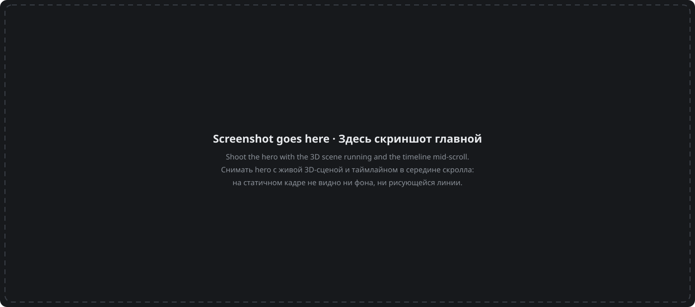

# samoy.love

Русский · [English](README.en.md)

[](https://github.com/tr0llex/samoy.love/actions/workflows/ci.yml)
[](https://codecov.io/gh/tr0llex/samoy.love)
[](https://samoy.love)
[](LICENSE)

Личная страница и витрина проектов Алексея Самойлова, теамлида в Почте
Mail.ru — вживую на **[samoy.love](https://samoy.love)**, для тех, кто решает,
хочет ли иметь с ним дело.

Резюме в документе отвечает на вопрос «что делал» и совсем не отвечает на
вопрос «как делает». Поэтому ответ — сама страница: карьера разложена как
level-путь, рабочие продукты — основной квест, pet-проекты — сайд-квесты, а
код можно прочитать целиком. Домен читается как фамилия владельца —
Самойлов, samoy.love, — и остальное хозяйство живёт под тем же именем.



## Как устроено

**Ноль JavaScript по умолчанию.** Astro 7, фреймворковых островов нет вовсе.
Вся главная — 20,8 КБ JS в gzip: входной скрипт 0,9, роутер переходов 5,3 и
чанк 3D-сцены 14,6. HTML — 7,5 КБ gzip, CSS — 7,9. Странице, которая обязана
быстро открыться у незнакомого человека с телефона, незачем возить рантайм
фреймворка ради текста, который не меняется.

**3D-фон hero на OGL, а не на three.js.** То же поле частиц, 14,6 КБ против
примерно 150. Сцена грузится динамическим `import()`, и решение принимается
*до* импорта: на устройстве с `hardwareConcurrency <= 4` или
`deviceMemory <= 4`, а также при `prefers-reduced-motion: reduce` эти
килобайты не скачиваются вообще. Отсюда три уровня — полная сцена,
анимированный CSS-градиент, полностью статика, — и контент никогда не заперт
за анимацией.

**Анимации без JavaScript.** Рисование линии таймлайна, заполнение полосы
опыта и появление секций — CSS scroll-driven animations
(`animation-timeline: view()`) под `@supports`. Обработчики скролла на JS —
классический способ получить дёрганую страницу и сломать её тем, кто выключил
движение; браузер делает ту же работу на композиторе и бесплатно.

**Переходы между страницами не текут контекстами.** Обложка карточки
перелетает в шапку страницы проекта через View Transitions. Роутер меняет DOM
без перезагрузки документа, поэтому сцена гасится по `astro:before-swap`:
иначе `requestAnimationFrame` продолжает рисовать в выброшенный канвас, а
каждый визит на главную оставляет ещё один WebGL-контекст. Сквозной тест
проверяет, что после возврата контекст ровно один.

**Ни чужих трекеров, ни cookie.** На странице нет скрипта аналитики, cookie не
ставятся, и куки-баннер закрывать нечего; шрифты лежат на своём домене, так
что браузер не просит ничего ни у кого, кроме samoy.love. Посещаемость при
этом считается — из отдельного узкого формата журнала nginx, где есть только
хост, запрос, код, объём и время ответа. `$remote_addr`, `$http_user_agent`,
`$http_referer` и `$cookie_*` там физически отсутствуют: связать два визита
одного человека попросту не по чему, а поле, которого нет, невозможно
случайно утечь через ошибку разбора.

Переходы к проекту, репозиторию и почте считаются тоже — пустым
`POST /e/<событие>` с ответом 204: ни тела, ни параметров, ни cookie, ни
идентификатора сессии или посетителя. В журнале остаётся строка того же вида:
домен, имя события, ноль байт. Раньше здесь было обещано «ноль трекеров» —
после появления этих счётчиков это перестало быть правдой буквально, и
обещание сформулировано от того, чего действительно нет. Считается, ЧТО
произошло, а не КТО это сделал.

Оба формата лежат в
[deploy-kit](https://github.com/tr0llex/deploy-kit/blob/main/nginx/conf.d/samoylove-log-metrics.conf),
читает их [metrics.samoy.love](https://github.com/tr0llex/metrics.samoy.love).

## Стек

`Astro 7` · `TypeScript` · `OGL (WebGL)` · `CSS scroll-driven animations` ·
`View Transitions` · `Vitest` · `Playwright` · `nginx`

## Быстрый старт

Node 22 или новее.

```bash
npm install
npm run dev          # дев-сервер
npm run build        # прод-сборка в dist/
npm run preview      # предпросмотр сборки
npm test             # тесты целостности контента
npm run e2e          # сквозные тесты (нужен npx playwright install chromium)
npm run og           # перегенерировать og-картинку
```

## Структура

| Путь | Назначение |
| --- | --- |
| `src/data/*.json` | профиль, путь, ачивки, рабочие кейсы, pet-проекты |
| `src/content/projects/*.md` | длинные описания проектов |
| `src/components/` | секции страницы |
| `src/islands/` | 3D-сцена и наклон карточек — единственный клиентский JS |
| `src/pages/` | главная, страницы проектов, 404 |
| `scripts/make-og.mjs` | генератор og-картинки из данных профиля |
| `e2e/` | сценарии Playwright и страж консоли и сети |
| `docs/design.md` | решения по дизайну и бюджеты производительности |
| `.deploy-kit/prod.env` | описание цели выкатки |

Добавить проект или ачивку можно без единой строки кода: контент — это JSON.

## Тесты

`npm test` — 17 тестов целостности контента. Данные разложены по нескольким
JSON и ссылаются друг на друга по идентификаторам, а опечатка в
идентификаторе не ломает сборку: Astro просто отрисует пустоту, и страница
молча потеряет секцию. Тесты проверяют, что ссылки разрешаются, обложки лежат
на диске, счётчики совпадают с тем, что считают, внешние ссылки идут по https,
а акцентные цвета разбираются.

`npm run e2e` — 7 сценариев Playwright по настоящей прод-сборке: главная
открывается со всеми секциями, навигация по якорям действительно доскролливает,
сцена hero инициализирует WebGL и переживает первые кадры, карточки ведут на
обещанные адреса, после ухода на проект и возврата сцена поднимается заново,
создав ровно один новый контекст, а на ширине телефона нет горизонтальной
прокрутки. Ещё три сценария (`npm run e2e:prod`) запускаются по живому сайту
руками, включая сверку выкаченной версии с `/version.json`.

Во всех тестах работает один и тот же страж: любая ошибка в консоли браузера и
любой неудачный сетевой запрос валят тест. Страница, отдающая 200 с упавшим
скриптом, здесь красная — а по коду ответа выглядела бы живой.

CI гейтит пулл-реквест юнит-тестами с покрытием, сборкой, проверкой ссылок и
ассетов в собранном HTML и полным сквозным прогоном. Выкатка прогоняет тесты и
сборку ещё раз, уже как собственный гейт: красный гейт — выкатки нет.

## Выкатка

Пуш в `main` собирает артефакт, раскладывает его рядом с текущим релизом и
атомарно переключает симлинк `current`, после чего сверяет `/version.json` и
проверяет соседние домены на том же хосте.

```bash
dk                       # что сейчас на проде
dk deploy samoy.love     # выкатить
dk rollback samoy.love   # откатить
```

Сама механика живёт в [deploy-kit](https://github.com/tr0llex/deploy-kit),
там же конфигурация nginx. Своих скриптов деплоя в этом репозитории нет.

## Часть samoy.love

Не россыпь пет-проектов, а одна система: один домен, один сервер, один
релизный пайплайн, одна статус-страница, один мониторинг.

| Проект | Что это | Код |
| --- | --- | --- |
| [samoy.love](https://samoy.love) | личная страница и витрина | [samoy.love](https://github.com/tr0llex/samoy.love) |
| [launcher.samoy.love](https://launcher.samoy.love) | ChillHub — лаунчер игр для Windows с обновлениями по диффу | [chillhub](https://github.com/tr0llex/chillhub) |
| [snakes.samoy.love](https://snakes.samoy.love) | мультиплеерный захват территории, бинарный WebSocket-протокол | [snakes](https://github.com/tr0llex/snakes) |
| [metro.samoy.love](https://metro.samoy.love) | офлайн-PWA со схемой московского метро | [metro-map](https://github.com/tr0llex/metro-map) |
| [status.samoy.love](https://status.samoy.love) | состояние сервисов: аптайм, версии, инциденты | [status.samoy.love](https://github.com/tr0llex/status.samoy.love) |
| [metrics.samoy.love](https://github.com/tr0llex/metrics.samoy.love) | мониторинг и посещаемость без чужих трекеров | [metrics.samoy.love](https://github.com/tr0llex/metrics.samoy.love) |
| — | общий релизный пайплайн | [deploy-kit](https://github.com/tr0llex/deploy-kit) |

## Контакты и лицензия

[alex@samoy.love](mailto:alex@samoy.love) · [t.me/tr0llex](https://t.me/tr0llex) ·
[github.com/tr0llex](https://github.com/tr0llex)

Это личная инфраструктура, и репозиторий читательский: PR не ожидаются,
вопросы — пожалуйста.

[MIT](LICENSE) © 2026 Алексей Самойлов
