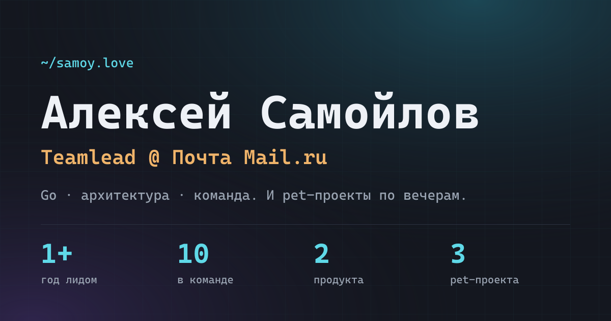

**Русский** · [English](docs/README.en.md)

# samoy.love

Личная страница в жанре игрового резюме: карьера как level-путь, рабочие
проекты — основной квест, pet-проекты — сайд-квесты.

**[samoy.love](https://samoy.love)** ·
[](https://github.com/tr0llex/samoy.love/actions/workflows/ci.yml)
[](https://codecov.io/gh/tr0llex/samoy.love)

<!-- Заглушка до реального скриншота: og-карточка, которую генерирует
     scripts/make-og.mjs из данных профиля. Заменить на снимок главной —
     одна строка. -->


> Домен читается как фамилия владельца — Самойлов.

## Что это

Алексей Самойлов, teamlead продуктовой команды в Почте Mail.ru, в прошлом
backend-разработчик. Страница подаёт карьеру как прокачку персонажа: путь от
школы до руководителя, рабочие кейсы, pet-проекты и ачивки, которые
«анлокаются» по мере скролла.

Это не мультяшная геймификация — пиксель-арта и полосок здоровья нет. Игровая
только структура подачи, визуальный язык сдержанный и тёмный. Решения и
обоснования — в [дизайн-документе](docs/design.md).

## Экосистема

Несколько проектов на одном сервере, с общим пайплайном выкатки.

| Проект | Что это | Стек |
|---|---|---|
| [samoy.love](https://samoy.love) | эта страница | Astro, OGL |
| [snakes.samoy.love](https://snakes.samoy.love) | мультиплеерный захват территории: 16 игроков, боты с ИИ | Go, бинарный WebSocket, Canvas |
| [metro.samoy.love](https://metro.samoy.love) | офлайн-PWA со схемой московского метро | React, Canvas, Go-решатель раскладки |
| [launcher.samoy.love](https://launcher.samoy.love) | ChillHub — лаунчер игр с обновлениями по диффу | Go, WPF, Blake3 |
| [status.samoy.love](https://status.samoy.love) | состояние сервисов | — |

Выкатка у всех одна — [deploy-kit](https://github.com/tr0llex/deploy-kit):
одно описание цели, один `release.sh` на сервере, там же живут конфиги nginx.

## Инженерная часть

- **Ноль JS по умолчанию.** Astro 7, фреймворковых островов нет вовсе.
  Клиентского кода — 21 КБ gzip: входной скрипт 1.0, роутер переходов 5.5 и
  чанк 3D-сцены 14.5, который грузится динамическим `import()` только там, где
  уместен. HTML главной — 6.6 КБ gzip, CSS — 7.8.
- **3D-фон hero на OGL, а не three.js** — 14.5 КБ против примерно 150 за тот
  же результат.
- **Три уровня деградации.** Full — 3D-сцена, рисующийся по скроллу таймлайн,
  наклон карточек. Lite (`hardwareConcurrency ≤ 4` или экономия трафика) —
  вместо WebGL анимированный градиент. Static (`prefers-reduced-motion`) — всё
  статично и видно сразу. Контент никогда не заперт за анимацией.
- **Анимации без JS.** Рисование линии таймлайна, заполнение полосы опыта и
  появление секций — CSS scroll-driven animations (`animation-timeline: view()`).
- **Переходы между страницами.** Обложка карточки перелетает в шапку страницы
  проекта через View Transitions. Роутер меняет DOM без перезагрузки, поэтому
  3D-сцена гасится по `astro:before-swap` и отпускает WebGL-контекст.
- **Ноль трекеров и куки-баннеров.** Наружу не уходит ничего.

Бюджеты производительности и обоснование решений — в [docs/design.md](docs/design.md).

## Тесты

`npm test` — 17 тестов целостности контента: данные разложены по нескольким
JSON и ссылаются друг на друга, а опечатка в идентификаторе не ломает сборку —
Astro просто отрисует пустоту. Тесты ловят это до выкатки.

`npm run e2e` собирает проект, поднимает `preview` и проходит страницу как
пользователь. Покрыто: главная открывается со всеми секциями; навигация по
якорям доскролливает; 3D-сцена инициализирует WebGL и переживает первые кадры;
карточки ведут на обещанные адреса; после ухода на проект и возврата сцена
поднимается заново, создав ровно один новый контекст; на ширине телефона нет
горизонтальной прокрутки.

Сквозная проверка во всех тестах: любая ошибка в консоли браузера и любой
неудачный сетевой запрос валят тест. Страница, отдающая 200 с упавшим
скриптом, здесь красная — а по коду ответа выглядела бы живой.

Смоук по живому сайту запускается отдельно и руками:

```bash
npm run e2e:prod                          # https://samoy.love
E2E_PROD_URL=https://... npm run e2e:prod # другой адрес
```

## Контент

| Путь | Что это |
|---|---|
| `src/data/*.json` | профиль, путь, ачивки, рабочие кейсы, pet-проекты |
| `src/content/projects/*.md` | длинные описания проектов |
| `src/components/` | секции страницы |
| `src/islands/` | 3D-сцена и наклон карточек — единственный клиентский JS |
| `scripts/make-og.mjs` | генератор og-картинки из данных профиля |
| `.deploy-kit/prod.env` | описание цели выкатки |

Добавить проект или ачивку можно без единой строки кода — правится JSON.

## Деплой

Пуш в `main` собирает артефакт, раскладывает его рядом с текущим релизом и
атомарно переключает симлинк, сверяя версию после переключения.

```bash
dk deploy samoy.love
dk rollback samoy.love
```

## Запуск

```bash
npm install
npm run dev          # дев-сервер
npm run build        # прод-сборка в dist/
npm run preview      # предпросмотр сборки
npm test             # тесты целостности контента
npm run e2e          # сквозные тесты (нужен npx playwright install chromium)
npm run og           # перегенерировать og-картинку
```
